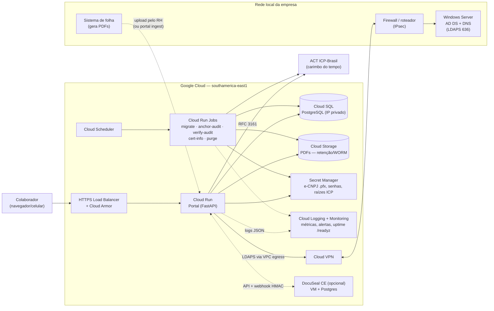
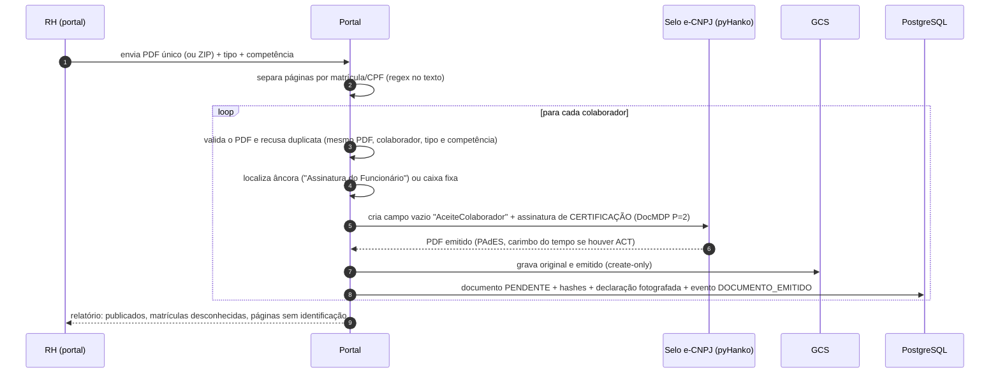
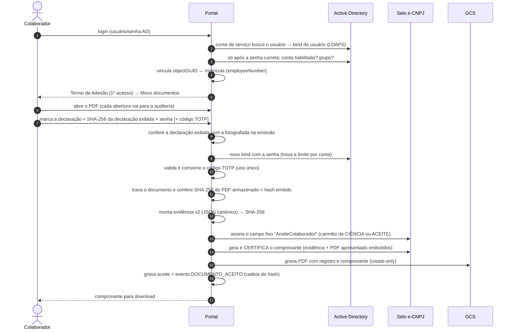

# Arquitetura

## Visão geral

| Componente | Papel | Observações |
|---|---|---|
| **Windows Server (local)** | Só AD e DNS | Recebe apenas *binds* LDAPS (636) vindos da VPN. Precisa de um certificado de servidor no DC (ver [integracao-ad.md](integracao-ad.md)). |
| **Portal (Cloud Run)** | Login, "Meus documentos", ciência/aceite, Termo de Adesão, área do RH, verificação pública | Stateless; sessões ficam no PostgreSQL. `/healthz` e `/readyz` (ver [Erros e saúde](#erros-e-saúde)). |
| **Cloud Run Jobs** | Migração do banco e rotinas agendadas | `migrate` roda com conta de serviço própria, a única que lê a credencial do dono do esquema. Rode-o antes do 1º deploy e após cada nova imagem. Agendados (America/Sao_Paulo): `anchor-audit` 02:15, `verify-audit` 02:45, `purge` domingo 03:30, `cert-info` segunda 07:50. Ver [operacao.md](operacao.md). |
| **Cloud SQL (PostgreSQL)** | Metadados, evidências, trilha de auditoria | Dois papéis (dono e aplicação) e gatilhos que tornam as evidências imutáveis (ver [Defesa em profundidade no banco](#defesa-em-profundidade-no-banco)). |
| **Cloud Storage** | PDFs (original, emitido, com registro, comprovantes, trilha DocuSeal) e tokens das âncoras | Gravação *create-only* (a conta do portal só cria e lê); *retention policy* (Bucket Lock) com prazo único para o bucket (buckets por classe documental: ver [roadmap](operacao.md#roadmap)). |
| **Secret Manager** | e-CNPJ A1 (.pfx), senhas, raízes ICP-Brasil | Montados como arquivo/variável. A credencial do dono do banco só é legível pela conta do job `migrate`. As raízes ICP-Brasil (`icp-raizes-pem`, fonte ITI) validam assinaturas em `/verificar`, o LTV e as âncoras. |
| **Cloud Logging / Monitoring** | Logs JSON, métricas, alertas e cópia dos eventos de auditoria | Ver [Logs](#logs) e [implantacao-gcp.md](implantacao-gcp.md). |
| **ACT ICP-Brasil** | Carimbo do tempo | Exigida em produção (PAdES B-T e ancoragem diária da auditoria), salvo `PORTAL_ALLOW_NO_TSA=true`, cuja ausência de carimbo fica registrada na evidência. |
| **DocuSeal CE** | Opcional, para modelos fixos (contratos) | Sem Pro: sem formulário embutido, sem SSO, sem PDF avulso via API. O selo é do portal: no DocuSeal use `CERTS={"enabled":false}`. |

## Fluxo de emissão (lote da folha)

- A emissão tem duas fases: validação e selo **sem gravar nem travar nada** (a chamada à
  ACT pode demorar); depois, gravação dos arquivos e do registro, com commit imediato.
- **Declaração fotografada:** o texto da declaração do tipo é copiado para o documento
  (`declaration_text` + `declaration_sha256`). Editar o tipo depois (área do RH →
  **Tipos**, auditado com antes/depois) não afeta documentos já emitidos.
- **Sem emissão duplicada:** o índice único parcial `uq_documentos_emissao_ativa`
  (colaborador, tipo, competência, SHA-256 do original) ignora documentos `CANCELADO`, o
  que permite reemitir depois de cancelar.
- Tipos que não exigem manifestação (ex.: informe de rendimentos) são certificados com
  DocMDP P=1, sem campo de aceite, e ficam `DISPONIVEL`.
- **Cancelamento:** só de `PENDENTE`/`DISPONIVEL`, com trava no documento (não colide com
  um aceite em andamento). Documento com manifestação não é cancelado: emite-se um
  documento retificador.

## Login, sessão e confirmação no ato

Detalhes do AD (atributos, grupos, mensagens) em [integracao-ad.md](integracao-ad.md).

- **Bind primeiro:** a conta de serviço localiza o usuário e o portal faz o *bind* com o
  DN e a senha digitada **antes** de olhar o estado da conta. Falhas antes ou durante o
  bind recebem mensagem genérica (o subcódigo do AD vai só para o log). Mensagens que
  revelam o estado da conta (desabilitada, fora do grupo do portal) só aparecem depois da
  senha correta, o que impede enumerar contas.
- **Limite por conta:** a chave é a conta canônica (sem `DOMINIO\` nem `@sufixo`, em
  minúsculas), então `EMPRESA\maria`, `maria@empresa.local` e `Maria` compartilham o
  contador. Checagem, bind e registro da tentativa são serializados por uma trava
  consultiva do PostgreSQL (`pg_advisory_xact_lock`): requisições paralelas não passam do
  limite (`PORTAL_LOGIN_MAX_FAILURES`, abaixo do `lockoutThreshold` do AD). As
  confirmações de senha no ato usam a mesma trava e o mesmo contador.
- **Limite por IP:** conta só falhas de **login** (`PORTAL_LOGIN_MAX_FAILURES_PER_IP`,
  padrão 50, alto para não bloquear o NAT do escritório).
- **Vínculo AD × cadastro:** no 1º login, pela matrícula do AD (`employeeNumber`, sem
  zeros à esquerda); depois, pelo `objectGUID`. Outra conta no mesmo cadastro
  (`VINCULO_AD_CONFLITO`) ou matrícula do AD diferente (`VINCULO_AD_DIVERGENTE`) bloqueia
  o login. Na readmissão com conta nova, o RH usa **Desvincular conta do AD**
  (`VINCULO_AD_REMOVIDO`, encerra as sessões) e o próximo login cria o novo vínculo.
- **Revalidação da sessão:** a cada `PORTAL_SESSION_REVALIDATE_MINUTES` (10) o portal
  consulta o AD. Conta desabilitada, fora do grupo, cadastro inativo ou vínculo divergente
  revogam a sessão (`SESSAO_REVOGADA`). AD indisponível não derruba sessões.
- **Confirmação no ato (*step-up*):** ciência/aceite, divergência e abertura do link
  DocuSeal exigem novo bind com a senha do AD e, quando `PORTAL_ACCEPT_MFA=totp` ou o
  tipo tem **exige TOTP**, o código do autenticador. Sem autenticador configurado, o
  colaborador é levado ao cadastro.
- **Segundo fator (TOTP, RFC 6238):** segredo cifrado (Fernet, chave derivada de
  `PORTAL_SECRET_KEY` por HKDF). Cadastrar exige a **senha do AD no ato** (uma sessão
  esquecida aberta não basta). Cada código vale uma vez (consumo atômico por `UPDATE`
  condicional). A tela mostra desde quando o autenticador está configurado ("não
  reconhece? procure o RH"). O RH pode **redefinir** (motivo obrigatório, encerra as
  sessões, `MFA_REDEFINIDO`); a evidência registra a data de configuração e as
  redefinições.
- **Termo de Adesão:** exigido antes do uso (`PORTAL_REQUIRE_ADHESION_TERM`). O aceite
  pelo portal exige a senha do AD e confere id + SHA-256 da versão lida (se o RH publicou
  outra no meio-tempo, mostra a nova). Gera um **comprovante PDF selado** com o texto
  integral do termo e a evidência JSON embutida, baixável em `/termo/comprovante`. O RH só
  registra adesões externas (**papel** ou **gov.br**); a adesão "portal" só pode ser feita
  pelo próprio colaborador.

## Fluxo de ciência/aceite (motor nativo)

- **Natureza:** cada tipo é de `ciencia` (holerite, informe: "recebi e tomei ciência") ou
  de `aceite` (contrato, aditivo: concordância). A natureza define o cabeçalho do carimbo
  ("CIÊNCIA ELETRÔNICA DO COLABORADOR" ou "ACEITE ELETRÔNICO DO COLABORADOR"), o título
  do comprovante e os textos da tela, e fica na evidência.
- **Divergência (recusa):** exige motivo (mínimo 10 caracteres) e a mesma confirmação no
  ato. O PDF não recebe carimbo; registram-se a frase fixa de divergência
  (`REFUSAL_DECLARATION`) e o motivo, nunca a declaração de concordância, e é gerado o
  "Comprovante de Registro de Divergência". O RH vê as divergências no painel.
- **Tudo ou nada:** todos os arquivos são gerados antes de qualquer gravação. Falha no
  selo/carimbo do tempo, no armazenamento ou no diretório resulta em nenhuma manifestação
  registrada e numa mensagem clara ao colaborador (só a tentativa de confirmação e o
  consumo do código TOTP ficam registrados).

**Por que duas assinaturas no mesmo PDF continuam válidas?** A assinatura de emissão
é de *certificação* com permissão "preencher formulários/assinar" (DocMDP P=2). O
aceite apenas assina um campo **pré-existente** em atualização incremental, o que é
uma alteração permitida. Qualquer outra mudança (texto, anexos, páginas) invalida a
certificação. Isso foi verificado nos testes (`tests/test_signing.py`) e na pesquisa
com pyHanko 0.37.

**O que prova o aceite?** A assinatura criptográfica é da empresa (o colaborador não
tem certificado). A manifestação de vontade é provada pela **evidência**:
- identidade AD (objectGUID, UPN, DN) e matrícula vinculada;
- confirmação no ato (senha do AD e, se exigido, TOTP, com data de configuração e
  redefinições);
- IP e porta, navegador, data/hora UTC e local (com o fuso);
- hash do documento exibido e todas as aberturas antes da decisão;
- declaração fotografada (texto + SHA-256);
- versão e canal do Termo de Adesão.

A evidência fica encadeada na auditoria, embutida no comprovante e referenciada pelo
hash no carimbo visível. Detalhes em
[assinatura-e-validade-juridica.md](assinatura-e-validade-juridica.md).

## Fluxo DocuSeal (opcional, contratos/aditivos)

1. O RH cria no DocuSeal um **modelo** com os campos em posição fixa e cadastra no portal
   (área do RH → **Tipos**) um tipo com motor `docuseal` e o `docuseal_template_id`.
2. O RH emite as pendências em **DocuSeal** (área do RH), por lista de matrículas. A
   declaração é fotografada; nenhum envio é criado no DocuSeal e nada vai por e-mail.
3. O colaborador, logado no AD, clica em **Abrir tela de assinatura**. O portal confere o
   Termo de Adesão, pede a confirmação (senha/TOTP) e só então cria o envio via API, com
   os seguintes parâmetros:
   - `send_email=false`, `expire_at` = 2 h;
   - `external_id` = id do documento;
   - `metadata` = identidade AD; nome e matrícula pré-preenchidos e bloqueados.

   O portal arquiva o envio anterior, se houver, registra `DOCUSEAL_LINK_ABERTO` (fatores
   confirmados, sessão, termo, `submitter_id`) e mostra uma página com o link de
   assinatura (a CSP `form-action 'self'` impede redirecionar o formulário para outro
   domínio).
4. O webhook `form.completed` ou `form.declined` (HMAC verificado) chega ao portal. Só a
   leitura e a verificação do HMAC rodam no laço de eventos; o processamento roda
   inteiramente numa thread, com sessão de banco própria. O portal:
   - aceita só o signatário do envio vigente e exige o `DOCUSEAL_LINK_ABERTO` desse
     **mesmo** signatário; senão registra `DOCUSEAL_SUBMITTER_DIVERGENTE` ou
     `DOCUSEAL_SEM_VINCULO_AD` e não conclui;
   - baixa a trilha do DocuSeal e **todos** os PDFs do envio;
   - **aplica o selo e-CNPJ por último, em cada PDF**: o DocuSeal achata o PDF e
     invalidaria um selo aplicado antes. O primeiro PDF é o principal; os demais ficam em
     `evidencia.documento.arquivos_adicionais` e no dossiê;
   - na recusa, registra a frase fixa `DECLINE_DECLARATION` ("Recusei a assinatura ...
     pelo motivo informado") e o motivo, nunca a declaração de concordância;
   - monta a evidência v2 (fatores confirmados ao abrir o link, IP e navegador vistos
     pelo portal, fuso e horário local, dados e trilha do DocuSeal), gera e sela o
     comprovante e só então grava arquivos e registro.

   Erro de rede, de download ou de selo vira `DocusealError`: o webhook responde 502 e o
   DocuSeal reenvia.

**Cliente da API.** O token (`X-Auth-Token`) vai **só** para `{DOCUSEAL_URL}/api/*`. Os
downloads usam as URLs assinadas do DocuSeal, sem token, e só são aceitos no mesmo
esquema e host:porta da URL configurada, inclusive nos redirecionamentos (no máximo 3,
sem rebaixamento https→http), com limite de 30 MB.

> Atrás do balanceador do GCP, o DocuSeal registra o IP do balanceador. O IP de
> referência é o capturado pelo portal no passo 3.

## Verificação pública (`/verificar`)

- Por **código de verificação** (campo para digitar ou link `/verificar/{código}`
  impresso no carimbo e no comprovante) ou por **upload do PDF**. No upload, o portal
  procura o SHA-256 entre as versões emitida, com registro e comprovante, e valida as
  assinaturas embutidas com as raízes ICP-Brasil configuradas
  (`PORTAL_SIGNING_TRUST_ROOT_FILES`).
- Mostra tipo, título, competência, situação, nome mascarado e hashes. Documento
  **cancelado** aparece como cancelado, com a data e sem o motivo (interno).
- O upload usa cookie CSRF próprio (não interfere num login aberto em outra aba).
  Com `PORTAL_PUBLIC_VERIFICATION=false`, a página exige login.

## Dossiê probatório

Exportado pelo RH por documento (ZIP, evento `DOSSIE_EXPORTADO`) e verificável sem o
portal:

| Arquivo | Conteúdo |
|---|---|
| `1-original.pdf` | PDF recebido da folha (no DocuSeal: o PDF assinado devolvido pelo DocuSeal) |
| `2-emitido-selado.pdf` | PDF certificado na emissão (motor nativo) |
| `3-com-registro.pdf` | PDF com o carimbo de ciência/aceite (nativo) ou com o selo final (DocuSeal) |
| `4-comprovante.pdf` | Comprovante selado, com a evidência e o PDF apresentado embutidos |
| `5-adicional-N.pdf` | Demais PDFs de um envio DocuSeal, cada um com o selo final |
| `6-trilha-docuseal.pdf` | Trilha de auditoria do DocuSeal |
| `evidencia.json` | Evidência (JSON canônico) cujo SHA-256 está no comprovante |
| `auditoria/segmento.jsonl` | Segmento contínuo da cadeia, do 1º evento do documento até a primeira âncora que cobre o **último** evento dele (ou a cabeça atual) |
| `auditoria/ancoras/*.tsr` | Carimbos do tempo RFC 3161 das âncoras |
| `termo/termo-vX.txt` | Texto do Termo de Adesão referenciado na evidência |
| `manifesto.json`, `LEIA-ME.txt` | Hash de cada arquivo e roteiro de verificação |
| `verificar.py` | Script autônomo (só biblioteca padrão do Python): confere os hashes dos arquivos, a cadeia e o *imprint* das âncoras; código de saída 0 = ÍNTEGRO |

## Trilha de auditoria

- Cada evento grava `hash = SHA-256(hash_anterior + "\n" + JSON canônico)`. A linha única
  `auditoria_cabeca` é travada (`SELECT ... FOR UPDATE`) a cada inclusão, o que impede
  bifurcar a cadeia.
- `portal anchor-audit` carimba diariamente, numa ACT, `SHA-256("portal-auditoria:<evento>:<hash>")`
  da cabeça. `portal verify-audit` faz a verificação **completa**: cadeia inteira e cada
  âncora (evento ancorado inalterado, token íntegro, *imprint* igual ao hash carimbado).
- A tela **Auditoria** do RH faz a verificação **incremental**, a partir da última âncora,
  e lista as âncoras. Ver [ADR 0005](adr/0005-evidencia-e-trilha-de-auditoria.md).

## Modelo de dados

| Tabela | Conteúdo |
|---|---|
| `colaboradores` | matrícula, nome, CPF (único), e-mail, ativo, vínculo AD (`ad_object_guid`, `ad_username`) |
| `tipos_documento` | código, nome, declaração, natureza (`ciencia`/`aceite`), exige aceite, exige TOTP, âncora (texto, página, caixa), motor, template DocuSeal, retenção, ativo |
| `lotes` | arquivo importado (hash) e relatório |
| `documentos` | status, código de verificação, declaração fotografada (texto + SHA-256), hashes e chaves das versões, motivo de cancelamento, ids do envio DocuSeal. Índice único parcial contra emissão duplicada |
| `aceites` | ciência/aceite ou divergência: decisão, motivo, origem (portal/DocuSeal), evidência completa (JSON canônico + hash). Um por documento. **Somente inclusão** |
| `auditoria` / `auditoria_cabeca` | eventos encadeados por hash (**somente inclusão**) e a linha da cabeça da cadeia (**só avança**) |
| `auditoria_ancoras` | carimbos do tempo da cabeça da cadeia. **Somente inclusão** |
| `termos_adesao` / `termos_adesao_aceites` | versões do termo (**imutáveis** depois de publicadas; só `active` muda) e adesões (portal/papel/gov.br) com evidência e comprovante (**somente inclusão**) |
| `mfa_totp` | segredo TOTP cifrado (Fernet/HKDF), data de configuração e último passo usado (anti-replay) |
| `sessoes`, `tentativas_login` | sessões no servidor (revogáveis, com a data da última revalidação no AD) e tentativas por conta canônica, IP e finalidade (login, aceite, termo, mfa); as antigas são expurgadas por `portal purge` |

## Defesa em profundidade no banco

Mesmo com a credencial da aplicação, evidências não podem ser alteradas nem apagadas.
Isso vale no PostgreSQL (produção); o SQLite de desenvolvimento não tem papéis nem
gatilhos.

| Papel | Uso | Privilégios |
|---|---|---|
| `portal_owner` | Dono do esquema (usuário do Cloud SQL). Usado só pelo job `migrate`, cuja conta de serviço é a única que lê o segredo `database-url-owner` | Cria tabelas, gatilhos e concede os privilégios |
| `portal_app` | Serviço e jobs agendados (segredo `database-url`). Criado via SQL por `portal db-app-role --papel portal_app` (LOGIN, sem superusuário, fora do `cloudsqlsuperuser`) | `SELECT, INSERT` nas tabelas somente-inclusão; `SELECT, INSERT, UPDATE` em `auditoria_cabeca` e `termos_adesao`; CRUD nas demais |

- **Gatilhos:** `auditoria`, `aceites`, `termos_adesao_aceites` e `auditoria_ancoras`
  bloqueiam `UPDATE`, `DELETE` e `TRUNCATE`. `auditoria_cabeca` só avança (não recua, não
  muda de id, não é apagada nem truncada). Em `termos_adesao`, versão, texto, hash e dados
  de publicação são imutáveis; só `active` muda, e não há `DELETE` nem `TRUNCATE`.
- Como não é dona das tabelas, a aplicação não consegue remover gatilhos nem tabelas.
- **Migração:** o job executa `portal db-app-role --papel portal_app && alembic -x
  app_role=portal_app upgrade head`. A migração cria os gatilhos, concede os privilégios
  ao papel informado e semeia a cabeça da cadeia (hash gênese).
- `tests/test_migrations.py` roda num PostgreSQL real (`PORTAL_TEST_DATABASE_URL`, também
  no CI) e confere esquema igual aos modelos, gatilhos e privilégios.

## Erros e saúde

- Páginas de erro em português (404, 405, dados inválidos, 500), mantendo o menu do
  usuário logado (a sessão é lida só para a navegação, nunca para autorizar). O erro
  inesperado mostra um **código de referência** para o suporte, o mesmo do log
  (`erro inesperado ref=<código>`).
- Clientes não-HTML e `/webhooks/*` recebem JSON (`{"detail": ...}`).
- `/healthz`: vivacidade (não toca em dependências).
- `/readyz`: banco acessível e certificado de selo configurado e dentro da validade; senão
  **503** com a lista de falhas. É o alvo do *uptime check*; o Cloud Armor libera só
  `GET /readyz` antes do filtro por país.

## Logs

- `PORTAL_LOG_FORMAT` = `json` (padrão em produção) ou `text`. Em JSON, cada linha traz
  `severity`, `message`, `logger`, `time` e, se houver, `stack_trace`, no formato que o
  Cloud Logging interpreta. Vale para o serviço e para os jobs (`portal ...`).
- Cada evento de auditoria gera também a linha `auditoria <AÇÃO> evento=<id>
  documento=<id>` (sem dados pessoais além dos ids). Ela alimenta métricas e o *sink* que
  copia os eventos para o bucket de logs de auditoria, de retenção longa (filtro
  `jsonPayload.message:"auditoria "`).
- Mensagens fixas usadas nos alertas: `CADEIA DE AUDITORIA COM FALHA` (`verify-audit`) e
  `CERTIFICADO e-CNPJ vence` (`cert-info --alerta-dias 45`), ambas com severity ERROR e
  código de saída 1, e `erro inesperado ref=`. Métricas e alertas em
  [implantacao-gcp.md](implantacao-gcp.md).

## Segurança (resumo)

- Sessão no servidor, cookie `__Host-` (HttpOnly, Secure, SameSite=Lax), expiração
  por inatividade e absoluta, revalidação periódica no AD, CSRF por sessão (login e
  verificação pública com cookie próprio), CSP restritiva, HSTS.
- Limite de tentativas por conta canônica (com trava, **abaixo** do limite de bloqueio
  do AD) e por IP (só falhas de login), para evitar bloqueio de contas por força bruta
  no portal.
- LDAPS com validação obrigatória de certificado. Senha vazia é rejeitada antes do
  bind (o AD aceita "unauthenticated bind").
- *Bind* do usuário primeiro e erros genéricos (sem enumeração de contas); subcódigos vão
  só para o log.
- Isolamento por colaborador: "não existe" e "não é seu" retornam o mesmo 404.
- IP do cliente extraído do `X-Forwarded-For` apenas pelos *hops* confiáveis.
- Webhook DocuSeal com HMAC e janela de 5 min. Token da API só em `/api/*`; downloads só
  do mesmo esquema e host:porta do DocuSeal (anti-SSRF).
- PDFs com hash conferido a cada leitura. Divergência gera o evento
  `INTEGRIDADE_FALHOU`.
- Privilégios mínimos no banco (ver acima) e no bucket (só criar e ler).
- Em produção a configuração recusa iniciar sem `https` em `PORTAL_BASE_URL`, LDAPS,
  `PORTAL_TRUSTED_PROXY_HOPS` ≥ 1, PostgreSQL, DocuSeal em `https` e ACT (ou
  `PORTAL_ALLOW_NO_TSA=true`). Os erros de configuração não ecoam valores (segredos).
  Todas as variáveis estão em `.env.example`.

## Evolução prevista

Ver [ADR 0004](adr/0004-autenticacao-ldaps-agora-keycloak-depois.md) (Keycloak/OIDC) e
[roadmap em operacao.md](operacao.md#roadmap).
