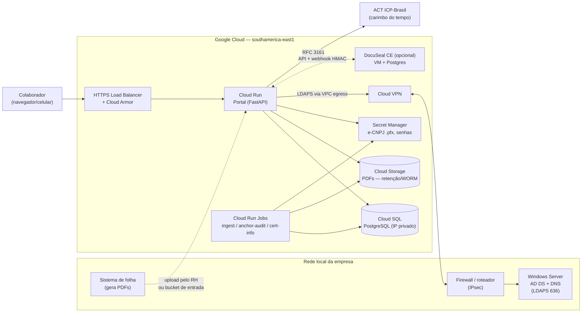
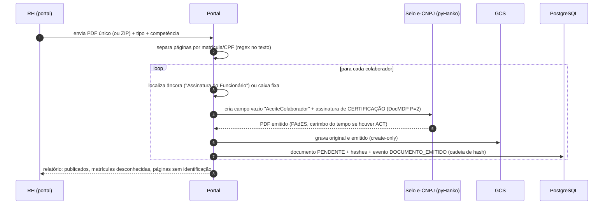
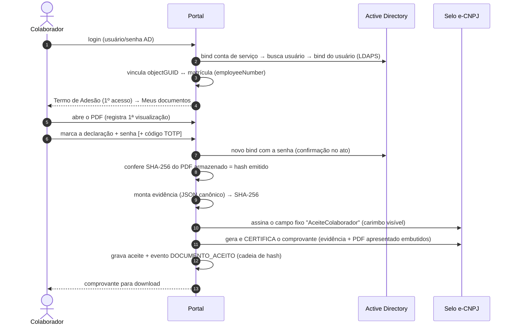

# Arquitetura

## Visão geral

| Componente | Papel | Observações |
|---|---|---|
| **Windows Server (local)** | Só AD e DNS | Recebe apenas *binds* LDAPS (636) vindos da VPN. Precisa de um certificado de servidor no DC (ver [integracao-ad.md](integracao-ad.md)). |
| **Portal (Cloud Run)** | Login, "Meus documentos", aceite, área do RH, verificação | Stateless; sessões ficam no PostgreSQL. |
| **Cloud SQL (PostgreSQL)** | Metadados, evidências, trilha de auditoria | Tabelas de auditoria/aceites são *append-only* (gatilho no banco). |
| **Cloud Storage** | PDFs (original, emitido, com aceite, comprovante) | Gravação *create-only*; *retention policy* (Bucket Lock) por classe documental. |
| **Secret Manager** | e-CNPJ A1 (.pfx) e senhas | Montados como arquivo/variável no Cloud Run; acesso só pela conta de serviço do portal. |
| **ACT ICP-Brasil** | Carimbo do tempo | Opcional, mas recomendado (PAdES AD-RT e ancoragem diária da auditoria). |
| **DocuSeal CE** | Opcional, para modelos fixos (contratos) | Sem Pro: sem formulário embutido, sem SSO, sem PDF avulso via API. |

## Fluxo de emissão (lote da folha)

## Fluxo de aceite (motor nativo)

**Por que duas assinaturas no mesmo PDF continuam válidas?** A assinatura de emissão
é de *certificação* com permissão "preencher formulários/assinar" (DocMDP P=2). O
aceite apenas assina um campo **pré-existente** em atualização incremental, o que é
uma alteração permitida. Qualquer outra mudança (texto, anexos, páginas) invalida a
certificação. Isso foi verificado nos testes (`tests/test_signing.py`) e na pesquisa
com pyHanko 0.37.

**O que prova o aceite?** A assinatura criptográfica é da empresa (o colaborador não
tem certificado). A manifestação de vontade é provada pela **evidência**:
- identidade AD (objectGUID, UPN, DN);
- reautenticação no ato;
- IP e porta, navegador e data/hora;
- hash do documento exibido;
- versão do Termo de Adesão.

A evidência fica encadeada na auditoria, embutida no comprovante e referenciada pelo
hash no carimbo visível. Detalhes em
[assinatura-e-validade-juridica.md](assinatura-e-validade-juridica.md).

## Fluxo DocuSeal (opcional, contratos/aditivos)

1. O RH cria no DocuSeal um **modelo** com os campos em posição fixa e registra no
   portal um tipo de documento com `engine=docuseal` e o `docuseal_template_id`.
2. O RH emite a pendência pelo portal: nenhum link é criado nem enviado por e-mail.
3. O colaborador, logado no AD, clica em **Abrir tela de assinatura**. O portal pede
   a confirmação (senha/TOTP) e só então cria o envio via API, com os seguintes
   parâmetros:
   - `send_email=false`, `expire_at` = 2 h;
   - `external_id` = id do documento;
   - `metadata` = identidade AD.

   O portal arquiva o envio anterior, se houver, e redireciona para `/s/{slug}`.
4. O webhook `form.completed` (HMAC verificado) chega ao portal, que:
   - baixa o PDF assinado e a trilha do DocuSeal;
   - **aplica o selo e-CNPJ por último**: o DocuSeal achata o PDF e invalidaria um
     selo aplicado antes;
   - gera o comprovante do portal e conclui.

> Atrás do balanceador do GCP, o DocuSeal registra o IP do balanceador. O IP de
> referência é o capturado pelo portal no passo 3.

## Modelo de dados

| Tabela | Conteúdo |
|---|---|
| `colaboradores` | matrícula, nome, CPF, e-mail, vínculo `ad_object_guid` |
| `tipos_documento` | layout/âncora do campo de aceite, declaração, motor, retenção |
| `lotes` | arquivo importado (hash) e relatório |
| `documentos` | status, código de verificação, hashes e chaves das versões |
| `aceites` | evidência completa (JSON canônico + hash). **Somente inclusão** |
| `auditoria` / `auditoria_cabeca` | eventos encadeados por hash. **Somente inclusão** |
| `auditoria_ancoras` | carimbos do tempo da cabeça da cadeia |
| `termos_adesao` / `termos_adesao_aceites` | versões do termo e adesões (portal/papel/gov.br) |
| `mfa_totp` | segredo TOTP cifrado (Fernet/HKDF) e anti-replay |
| `sessoes`, `tentativas_login` | sessões no servidor (revogáveis) e limitação de tentativas |

## Segurança (resumo)

- Sessão no servidor, cookie `__Host-` (HttpOnly, Secure, SameSite=Lax), expiração
  por inatividade e absoluta, CSRF por sessão, CSP restritiva, HSTS.
- Limite de tentativas por usuário e por IP **abaixo** do limite de bloqueio do AD,
  para evitar bloqueio de contas por força bruta no portal.
- LDAPS com validação obrigatória de certificado. Senha vazia é rejeitada antes do
  bind (o AD aceita "unauthenticated bind").
- Erros de AD genéricos (sem enumeração de contas); subcódigos vão só para o log.
- Isolamento por colaborador: "não existe" e "não é seu" retornam o mesmo 404.
- IP do cliente extraído do `X-Forwarded-For` apenas pelos *hops* confiáveis.
- Webhook DocuSeal com HMAC e janela de 5 min. Downloads só do host do DocuSeal
  (anti-SSRF).
- PDFs com hash conferido a cada leitura. Divergência gera o evento
  `INTEGRIDADE_FALHOU`.

## Evolução prevista

Ver [ADR 0004](adr/0004-autenticacao-ldaps-agora-keycloak-depois.md) (Keycloak/OIDC) e
[roadmap em operacao.md](operacao.md#roadmap).
